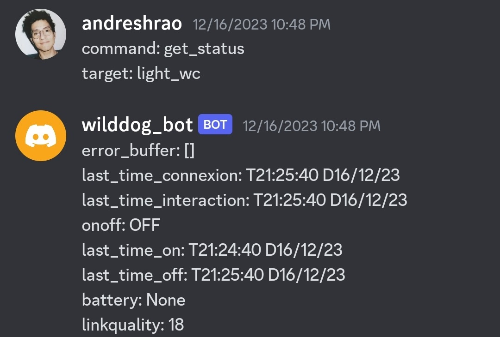
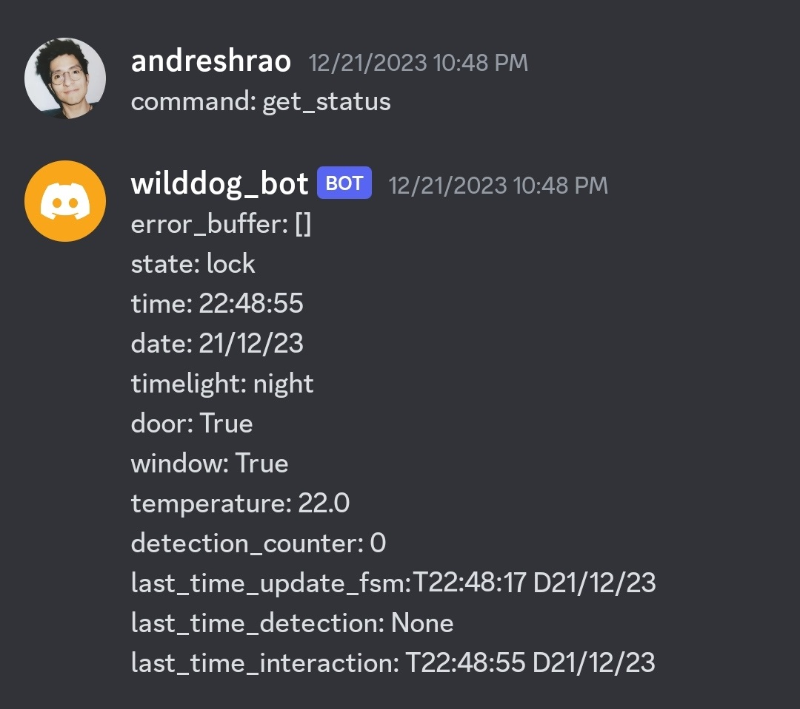
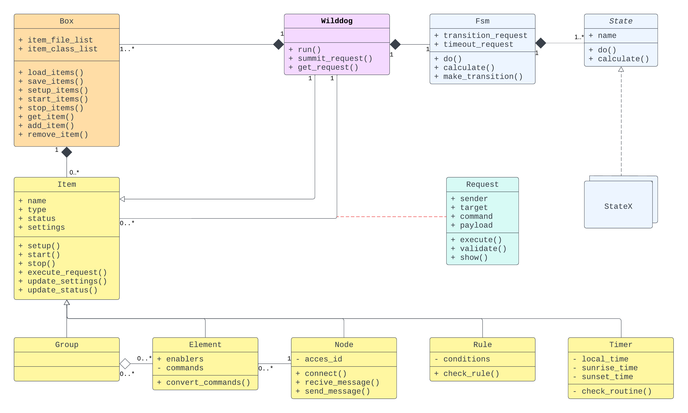
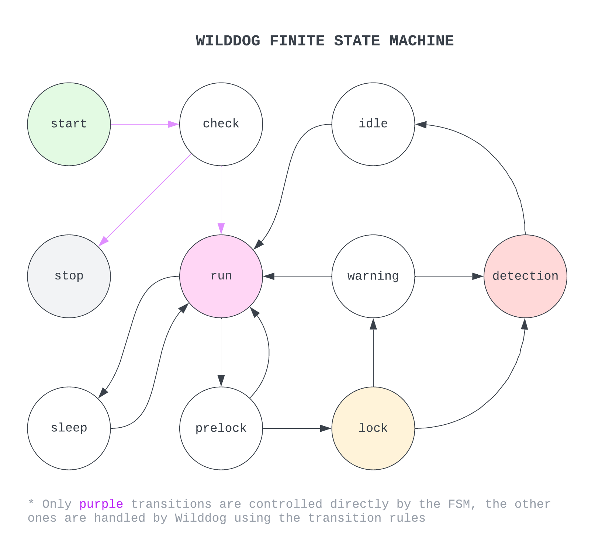

## WHAT IS WILDDOG
Wilddog is a home automation system that provides a high level of control and flexibility for your setup. With Wilddog, you can program a wide range of scenarios/rules, events, device contexts, and more. It runs on your own server and can be integrated with other services such as an MQTT server or Discord server.

<br>

## INSTALLATION
Installation is simple and does not require many packages. In this version of Wilddog, we include two built-in nodes that can handle MQTT and Discord messages. You can create more nodes if needed. That is why we also include the Paho and Discord packages. In my case, most of the devices are connected using the MQTT node to receive messages from a [zigbee2mqtt](https://github.com/Koenkk/zigbee2mqtt) module , and I also feedback/control using the Discord node with a bot.

```python
pip install -r requirements.txt
```

<br>

## RUNNING
Running just requires a SystemWilddog instance.

```python
from modules import SystemWilddog

# ---- MAIN ----
def main():
	wd = SystemWilddog()
	wd.run()
```

<br>



<br>

## CUSTOMIZE SYSTEM
Wilddog can be customized by using files in `/data` or by creating your own Elements, Nodes, Rules, Groups, etc. The majority of the behavior system is defined in `rules.yaml` and `systems.yaml`. Feel free to modify these documents while always following the structure and examples of each object.

<br>

## ARCHITECTURE

<br>

<br>

### ITEMS
Items are the most fundamental component in the system. They can be created, initialized, started, and most importantly, they can execute Requests. The majority of instances in the system are Items, including external devices, communication bridges, groups of other items, and even the main system itself (WD). Each Item has a unique name (wid), configuration (settings), status, and specific methods based on its type (Elements, Rules, Nodes, Groups, Timers, Systems).

<br>

- Systems: WD is the only instance of Systems, which is the main Item representing the context system and the first object to be created. WD contains all other Items and is responsible for creating, configuring, and starting them. Once items are created, WD's main purpose is to find, evaluate, and execute all available Request. However, most of them are not executed by WD itself but are redirected to the responsible item.
- Elements: Elements and Timers are the only items capable of submitting Requests. Elements are typically external devices such as sensors, actuators, bots, HMI, etc. Elements require an Item Node to communicate with external services. They also have specific methods to handle incoming and outgoing messages to and from Nodes.
- Nodes: Nodes handle communication with external servers/systems. They contain internal (wid) and external (sid) references to every Element.
- Rules: Rules are one of the most important items. They contain all the scenarios/rules that describe how every single element interacts with others and/or with WD. Rules can also define most of the FSM transitions. WD receives requests from other items, and by checking the rule conditions, it can determine whether the request should be executed or not.
- Timers: Timers are internal Elements that interact directly with WD and other components. They have the following responsibilities: resetting/updating system parameters such as door status, window status, internal clock, detection counter, etc., and powering off certain elements when a timeout occurs.
- Groups: Groups represent a collection of Items. They can be used to create Requests or rules. Instead of creating a large number of individual Requests, we can use a single Request that points to a Group. Groups can be assigned as senders or targets in a Request/Rule.

<br>

### BOXES
Items are organized in Boxes, they allow easily: load/save configuration, setup and start Items. For every kind of Item there is a box: Elements, Rules, Groups, Timers and Node. There is also a box Systems, but with a single Item, WD.

<br>

### REQUESTS (RQT)
Requests are objects that contain commands or information sent from one Item to another in order to execute a task. Examples of tasks include turning on a lamp, turning off a group of lights, retrieving the status of a sensor, announcing a detection (intrusion), or requesting a FSM transition. A Request consists of a Sender, a Target, a Command, and a Payload. The Sender attribute identifies the creator of the Request, while the Target points to the intended recipient (including Groups). The Command is an instruction that the Target can understand, with some commands being common to all Items (e.g. update_setting, get_settings, get_status). The payload contains additional information required to execute the command.

In addition to the these attributes, Requests also include a Message field, which contains the original information received by the Node. Once the Request goes through the Rules, the Payload can be loaded using the information in the Message or settled using the information already contained in the Rules. It is important to note that a single Request can trigger several Rules, resulting in the creation of multiple new Requests based on the original one.

<br>

### THE FSM
The Finite State Machine (FSM) defines the behavior of WD. The FSM controls the creation of Items, the reading or ignoring of Requests, the monitoring of intrusions, and more. When performing transitions, the FSM does not directly monitor parameters/status in the system or other Items. Instead, it waits for commands from WD. Transitions are defined by the user using Rules. A transition can be triggered by the action of an Item (e.g. button pressed, movement detected), but the Request must first be evaluated by WD. Only certain transitions are allowed (see picture below). After each transition, the FSM sends a Request to indicate to other Items that a transition has occurred. Transitions can also be automatic, as each State has a timeout. This means that the FSM can remain in a State for a specific period of time. The timeout can be undefined.

<br>

<br>

- Start: The system creates, loads, sets up, and starts all Items.
- Check: The system waits for all Items to be started.
- Stop: If something goes wrong while starting Items, the system can stop.
- Run: Defines the main State where all Items are ready, WD can now receive and send requests.
- Sleep: Defines the behavior when the user is sleeping, which can have the same rules as the Run State or not.
- Prelock: Defines the behavior when the user is trying to lock the house. Usually, this State has a timeout, which allows the user to leave the house and close it.
- Lock: Defines the behavior when the user is not at home. Intrusion detection can be used.
- Warning: Defines the behavior when the user returns. Normally, a timeout is also used, giving the user time to unlock the system and stop the alarm activation.
- Detection: Defines the behavior when an intrusion is detected.
- Idle: This State can be used to define the behavior or State before returning to the Run State, such as actions to take after a detection (e.g. turn off all). Idle normally has a timeout.

The FSM is very flexible and can be modified just using Rules. It is possible to detect intrusions in every State or enable only specific sensors for a transition or detection.

<br>

## NEXT RELEASES
- Build error handler
- Build add/remove functions for boxes
- Build Item simulator
- Build watchdog
- Build additional Nodes

## NOTES
The names of some functions/variables in this document may differ from those used in the source code.
